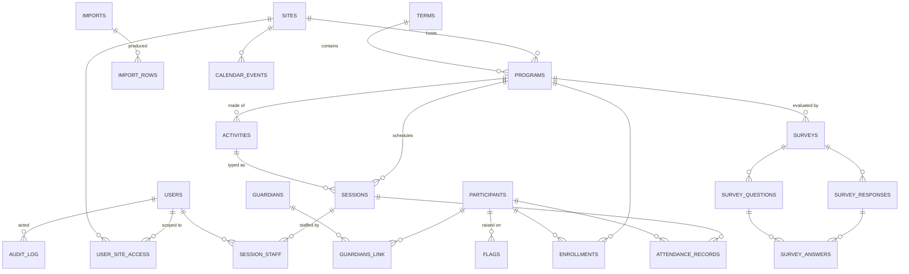

# Beacon — After-School Program Intelligence Platform

**Product blueprint v1.1 · July 2026**
*Prepared for: Marlon Richards · Working name "Beacon" is a placeholder — swap freely.*

This document is implementation-ready: it can be handed to a product team, designer, or developer as-is. It contains five parts, in order:

1. [Product Requirements Document](#1-product-requirements-document)
2. [Database Schema](#2-database-schema)
3. [Screen-by-Screen App Layout](#3-screen-by-screen-app-layout)
4. [Wireframe-Style Page Map](#4-wireframe-style-page-map)
5. [Main Dashboard UI/UX](#5-main-dashboard-uiux) *(spec + the rules the build must preserve; the working mockup is `dashboard-mockup.html`)*

Plus: [Additional features worth building](#6-additional-features-worth-building) and an [MVP release plan](#7-release-plan).

---

## 1. Product Requirements Document

### 1.1 Vision

After-school programs run on scattered spreadsheets: attendance in one workbook, enrollment in another, survey results in a Google Form, the activity calendar on a whiteboard. Beacon is a single workspace where program staff **import the data they already have** (Excel/CSV), track attendance and enrollment going forward, plan programs on a live calendar, collect feedback with built-in surveys, and get **decision-grade reports and dashboards** out the other end — the kind of evidence funders, school partners, and boards ask for.

**One-line promise:** *Drop your spreadsheets in; get answers out.*

### 1.2 Problem statements

| # | Problem today | Beacon's answer |
|---|---|---|
| P1 | Data lives in many inconsistent Excel files; nobody trusts the totals | Import wizard with column mapping, validation, and de-duplication |
| P2 | Attendance is captured on paper or ad-hoc sheets, entered late or never | Roster-based daily check-in, kiosk mode, bulk entry, missing-data alerts |
| P3 | Planning happens on whiteboards; conflicts and staffing gaps are found too late | Program/activity planner with recurring sessions, capacity, and staff assignment on a monthly calendar |
| P4 | Feedback is collected sporadically and never connected to attendance or outcomes | Built-in survey builder; responses linked to programs and participants |
| P5 | Funder/board reports take days to assemble by hand | Report templates (monthly, attendance, grant/funder) exportable to PDF/Excel, schedulable by email |
| P6 | No early warning when a student disengages or a program underperforms | Risk flags (chronic absence, falling ratings, capacity issues) surfaced on the dashboard |

### 1.3 Users and roles

Role-based access control (RBAC). Every user has exactly one role per organization; permissions are enforced at the API layer, not just the UI.

| Role | Who | Can do | Cannot do |
|---|---|---|---|
| **Admin** | Executive director, ops manager | Everything: users, sites, settings, imports, deletes, audit log | — |
| **Program Director** | Site coordinator, program manager | Create/edit programs, sessions, surveys, reports; run imports; manage rosters; see all data for their assigned site(s) | Manage users, change org settings, hard-delete records |
| **Staff / Instructor** | Group leaders, teachers, part-time staff | Take attendance for their own sessions; view their schedule and rosters; log notes/incidents | Edit programs, run imports, see other sites, export participant PII |
| **Viewer** | Funder liaison, board member, school partner | View dashboards and published reports (aggregate only, no PII by default) | Everything else |

**Privacy note:** participant data is minor/student data. Viewer role sees aggregates only; PII visibility is a per-role toggle; every export of PII is written to the audit log.

### 1.4 Core modules and functional requirements

Requirements are numbered `FR-x.y` for traceability. **MVP** items are flagged; everything else is Phase 2+ (see §7).

#### Module A — Data Import Center

The front door of the product. Pattern borrowed from Airtable's CSV import and Flatfile-style mapping wizards.

- **FR-A.1 (MVP)** Upload `.xlsx`, `.xls`, `.csv` (drag-and-drop or file picker), up to 25 MB / 50,000 rows. Multi-sheet workbooks prompt for a sheet.
- **FR-A.2 (MVP)** Three-step wizard: **Upload → Map → Review**. Map step auto-suggests column matches (e.g. "Student Name" → `first_name`+`last_name` split, "DOB" → `date_of_birth`) with manual override; target types: Participants, Attendance history, Enrollments, Programs, Survey responses.
- **FR-A.3 (MVP)** Validation report before commit: type errors (bad dates, non-numeric ages), missing required fields, out-of-range values — each row flagged fix-in-place, skip, or accept.
- **FR-A.4 (MVP)** Duplicate detection on participants (fuzzy match on name + DOB, exact on external student ID) with merge/skip/create-anyway resolution.
- **FR-A.5 (MVP)** Saved mapping templates: "March attendance export" mapping is reusable next month in one click.
- **FR-A.6** Import history with row counts, error counts, who ran it, and **one-click rollback** of any import (soft-delete of the rows it created).
- **FR-A.7** Scheduled/recurring imports from a watched cloud folder (Phase 3).

#### Module B — Participants & Enrollment

- **FR-B.1 (MVP)** Participant profile: name, DOB/age, grade, school, guardian contacts, emergency contact, allergies/medical notes, photo-consent flag, custom fields (org-defined).
- **FR-B.2 (MVP)** Enroll participants in programs with status (`enrolled`, `waitlisted`, `withdrawn`, `completed`), start/end dates, and enrollment source.
- **FR-B.3 (MVP)** Searchable, filterable roster list (program, grade, school, status, attendance-rate band) with bulk actions and CSV export.
- **FR-B.4** Waitlist auto-promotion when a seat opens, with notification to the director.
- **FR-B.5** Guardian communication log (calls, emails, notes) on the profile timeline.

#### Module C — Programs & Activity Planning

Pattern borrowed from Sawyer and EZChildTrack: program → activities → scheduled sessions.

- **FR-C.1 (MVP)** Program entity: name, category (STEM, arts, sports, tutoring, enrichment…), site, term, capacity, age/grade range, funding source tag, goals/description.
- **FR-C.2 (MVP)** Activities within a program (e.g. "Robotics Club" program → "Build day", "Competition prep" activities) with default duration, room, and materials list.
- **FR-C.3 (MVP)** Session scheduling: one-off or recurring (RRULE: weekly Mon/Wed 3:30–5:00 until Dec 15), each session linked to staff, room, and roster.
- **FR-C.4 (MVP)** Conflict detection at save time: same room, same staff, or same participant double-booked → warning with details.
- **FR-C.5** Staff-to-participant ratio target per program; sessions breaching ratio are flagged on the calendar and dashboard.
- **FR-C.6** Program templates: clone last term's program with all activities and schedule shifted to new dates.

#### Module D — Attendance

- **FR-D.1 (MVP)** Per-session roster check-in: tap each name → `present / absent / excused / late`; optional time-in/time-out capture.
- **FR-D.2 (MVP)** Bulk entry grid ("everyone present except…") and backfill mode for entering paper records after the fact.
- **FR-D.3 (MVP)** Attendance rate computed per participant, per program, per site, per period — the core metric feeding dashboards.
- **FR-D.4** Kiosk mode: a tablet at the door where students self-check-in by name/PIN; sign-out requires an authorized-pickup name.
- **FR-D.5 (MVP)** Missing-attendance alert: any session >24h old with no attendance recorded appears on the dashboard until resolved.
- **FR-D.6** Chronic-absence flag: attendance < 80% over trailing 4 weeks (threshold configurable) flags the participant for follow-up. *(Mirrors the "chronic absenteeism" definition used by 21st CCLC-style reporting.)*

#### Module E — Calendar & Scheduling

- **FR-E.1 (MVP)** Month view (default), week and day views; color-coded by program category; filter by site, program, staff.
- **FR-E.2 (MVP)** Drag-to-reschedule a session; drag-to-extend duration; edits to one occurrence vs. the whole series prompt explicitly.
- **FR-E.3 (MVP)** Non-session events: field trips, staff meetings, closures/holidays (closures suppress attendance-missing alerts).
- **FR-E.4** Month print/PDF export — the "fridge calendar" families actually use.
- **FR-E.5** ICS feed per site/staff member so schedules appear in Google/Outlook calendars.
- **FR-E.6** Month-by-month planning mode: a term view showing which weeks each program runs, with gaps and overloads visible at a glance.

#### Module F — Surveys & Feedback

Pattern borrowed from Google Forms / SurveyMonkey builders, plus program-evaluation practice (pre/post design).

- **FR-F.1 (MVP)** Survey builder with question types: multiple choice, checkboxes, 1–5 rating, 0–10 scale (NPS-style), short text, long text, yes/no.
- **FR-F.2 (MVP)** Audience targeting: participants, guardians, staff, or anonymous public link/QR code; optionally linked to a specific program and term.
- **FR-F.3 (MVP)** Response dashboard per survey: response rate, per-question charts, text answers in a scannable list, CSV export.
- **FR-F.4** Pre/post pairing: mark two surveys as a pair; results screen shows before/after deltas per question.
- **FR-F.5** Templates library: program satisfaction (participant + guardian versions), staff end-of-term reflection, event feedback, SEL self-assessment.
- **FR-F.6** Reminder nudges to non-responders (email/SMS, Phase 3).

#### Module G — Analytics & Dashboards

- **FR-G.1 (MVP)** Main dashboard (spec in §5): KPI row, attendance trend, enrollment by program, alerts, today's schedule, recent imports.
- **FR-G.2 (MVP)** Program detail analytics: enrollment vs. capacity, attendance trend, retention (still-enrolled % over the term), survey ratings.
- **FR-G.3** Explorer: pick a metric (attendance rate, enrollment, ratings), a dimension (program, site, grade, weekday), and a period → chart + table, saveable as a dashboard card.
- **FR-G.4** Cohort comparison: any two programs/terms/sites side by side.
- **FR-G.5** All charts export as PNG and their data as CSV.

#### Module H — Reports

- **FR-H.1 (MVP)** Report templates, each rendered as a formatted document (PDF) and a data workbook (Excel):
  - **Monthly Program Report** — per program: sessions held, enrollment, average daily attendance, attendance rate, notable flags, survey pulse.
  - **Attendance Summary** — per participant grid across a date range (the school-partner request).
  - **Funder/Grant Report** — aggregate outcomes filtered by funding-source tag: unduplicated participants served, attendance hours, demographics (aggregate), survey outcomes.
- **FR-H.2 (MVP)** Every report carries generated-by, date range, filters used, and a data-freshness stamp.
- **FR-H.3** Scheduled delivery: email a report to a recipient list monthly/quarterly.
- **FR-H.4** Narrative builder: drop charts and KPI callouts into a rich-text report body for board decks.

#### Module I — Administration

- **FR-I.1 (MVP)** User management: invite by email, assign role + site scope, deactivate.
- **FR-I.2 (MVP)** Org settings: sites/locations, terms (Fall 2026…), program categories, attendance statuses, chronic-absence threshold, custom participant fields.
- **FR-I.3 (MVP)** Audit log: every create/update/delete/export with actor, timestamp, and before/after snapshot; filterable; retained ≥ 2 years.
- **FR-I.4** Data retention & purge policy tools (e.g. purge withdrawn participants after N years) — admin-only, double-confirmed, logged.

### 1.5 Non-functional requirements

| Area | Requirement |
|---|---|
| **Privacy & security** | Participant data is minors' data: encrypt at rest and in transit; RBAC enforced server-side; PII excluded from Viewer role and from logs; export of PII always audit-logged. Design to FERPA-aware practices if school data is ingested; obtain guardian consent flags at enrollment. |
| **Accessibility** | WCAG 2.1 AA. Full keyboard operability (attendance check-in must work keyboard-only), visible focus states, color never the sole encoding on charts, `prefers-reduced-motion` respected. |
| **Performance** | Import of 10k rows completes < 60 s with progress; dashboard first paint < 2 s at 5k participants; attendance check-in interaction < 100 ms per tap. |
| **Reliability** | Attendance capture tolerates flaky Wi-Fi: check-ins queue locally and sync (staff devices in gyms/basements). Nightly backups; 30-day point-in-time restore. |
| **Devices** | Responsive web app. Attendance and kiosk screens are tablet-first; admin/reporting screens are desktop-first; everything usable on a phone. |
| **Data quality** | Nothing enters the system without passing validation; every record traceable to its source (import file or user action). |

### 1.6 Success metrics (for the product itself)

- ≥ 90% of sessions have attendance recorded within 24 hours (the P2 fix).
- Monthly funder report produced in < 15 minutes (from days).
- ≥ 95% of imported rows committed without manual rework after the first month (mapping templates working).
- Survey response rate ≥ 50% on program-satisfaction surveys.
- Weekly active usage by every Program Director.

### 1.7 Prior art this design draws on

- **Sawyer / ACTIVE Network / EZChildTrack** — program → session → roster hierarchy, capacity and waitlists, term-based cloning.
- **Procare / Brightwheel** — tablet check-in/out with authorized pickup, guardian contact patterns.
- **Cayen / TransAct (21st CCLC reporting)** — attendance-rate and unduplicated-participant definitions, funder report shape, chronic-absence flagging.
- **Google Forms / SurveyMonkey** — survey builder ergonomics, response dashboards.
- **Airtable / Flatfile** — CSV/Excel import mapping wizard, saved mapping templates, validation-before-commit.

---

## 2. Database Schema

Relational (PostgreSQL). Conventions: every table has `id` (UUID, PK), `created_at`, `updated_at`; soft delete via `deleted_at` where noted; all foreign keys indexed. Multi-tenant ready via `org_id` on every table (omitted below for brevity — assume it everywhere).

### 2.1 Entity-relationship overview



### 2.2 Tables

**users**
| Field | Type | Notes |
|---|---|---|
| id | uuid PK | |
| email | text unique | login identity |
| full_name | text | |
| role | enum(`admin`,`director`,`staff`,`viewer`) | one role per org |
| status | enum(`invited`,`active`,`deactivated`) | |
| last_login_at | timestamptz | |

**user_site_access** — `user_id FK`, `site_id FK`; unique pair. Admins implicitly have all sites.

**sites** — `name`, `address`, `timezone`, `is_active`.

**terms** — `name` ("Fall 2026"), `starts_on date`, `ends_on date`.

**participants**
| Field | Type | Notes |
|---|---|---|
| id | uuid PK | |
| external_id | text nullable | school/student ID; unique per org when present — dedupe key |
| first_name / last_name | text | |
| date_of_birth | date | |
| grade | text | K–12 free label |
| school | text | |
| gender | text nullable | free text, optional |
| medical_notes | text nullable | encrypted column |
| photo_consent | boolean default false | |
| custom_fields | jsonb | org-defined fields (FR-B.1) |
| source_import_id | uuid FK nullable | provenance |
| deleted_at | timestamptz nullable | soft delete |

**guardians** — `first_name`, `last_name`, `phone`, `email`, `is_emergency_contact bool`, `authorized_pickup bool`.
**guardians_link** — `participant_id FK`, `guardian_id FK`, `relationship` text.

**programs**
| Field | Type | Notes |
|---|---|---|
| id | uuid PK | |
| site_id / term_id | FK | |
| name | text | |
| category | enum/text | STEM, arts, sports, tutoring… (org-configurable list) |
| description_goals | text | |
| capacity | int | |
| grade_min / grade_max | text | |
| ratio_target | int nullable | participants per staff (FR-C.5) |
| funding_source | text nullable | grant/funder tag (FR-H.1) |
| status | enum(`planning`,`active`,`completed`,`archived`) | |

**activities** — `program_id FK`, `name`, `default_duration_min int`, `default_room text`, `materials text`.

**enrollments**
| Field | Type | Notes |
|---|---|---|
| participant_id / program_id | FK, unique pair | |
| status | enum(`enrolled`,`waitlisted`,`withdrawn`,`completed`) | |
| enrolled_on / withdrawn_on | date | |
| waitlist_position | int nullable | |
| source | enum(`manual`,`import`,`waitlist_promo`) | |

**sessions**
| Field | Type | Notes |
|---|---|---|
| program_id FK, activity_id FK nullable | | |
| starts_at / ends_at | timestamptz | |
| room | text | conflict check key (FR-C.4) |
| recurrence_id | uuid nullable | groups occurrences of one series |
| status | enum(`scheduled`,`completed`,`cancelled`) | |
| attendance_locked | boolean | true once director signs off |

**session_staff** — `session_id FK`, `user_id FK`, `role_on_session` enum(`lead`,`assistant`).

**attendance_records**
| Field | Type | Notes |
|---|---|---|
| session_id / participant_id | FK, unique pair | |
| status | enum(`present`,`absent`,`excused`,`late`) | |
| time_in / time_out | timestamptz nullable | kiosk & sign-out |
| picked_up_by | text nullable | authorized pickup name |
| recorded_by | uuid FK users | |
| source | enum(`roster`,`kiosk`,`bulk`,`import`) | provenance |

**imports**
| Field | Type | Notes |
|---|---|---|
| file_name, file_size, sheet_name | | |
| target_type | enum(`participants`,`attendance`,`enrollments`,`programs`,`survey_responses`) | |
| mapping_template_id | uuid FK nullable | |
| status | enum(`mapping`,`validating`,`committed`,`rolled_back`,`failed`) | |
| rows_total / rows_committed / rows_skipped / rows_errored | int | |
| run_by | uuid FK users | |

**import_mapping_templates** — `name`, `target_type`, `column_map jsonb` (source header → field), `run_count int`.
**import_rows** — `import_id FK`, `row_number`, `raw jsonb`, `outcome` enum(`committed`,`skipped`,`errored`), `created_record_table/id` — enables FR-A.6 rollback.

**surveys**
| Field | Type | Notes |
|---|---|---|
| title, description | | |
| audience | enum(`participants`,`guardians`,`staff`,`public`) | |
| program_id / term_id | FK nullable | linkage for analytics |
| status | enum(`draft`,`open`,`closed`) | |
| is_anonymous | boolean | |
| public_token | text unique nullable | link/QR access |
| paired_survey_id | uuid nullable | pre/post pairing (FR-F.4) |

**survey_questions** — `survey_id FK`, `position int`, `prompt text`, `qtype` enum(`multiple_choice`,`checkboxes`,`rating_1_5`,`scale_0_10`,`short_text`,`long_text`,`yes_no`), `options jsonb`, `required bool`.
**survey_responses** — `survey_id FK`, `respondent_participant_id/guardian_id/user_id` (all nullable — anonymous allowed), `submitted_at`.
**survey_answers** — `response_id FK`, `question_id FK`, `value jsonb`.

**calendar_events** — non-session events: `site_id FK`, `title`, `event_type` enum(`field_trip`,`meeting`,`closure`,`other`), `starts_at`, `ends_at`, `all_day bool`. Closures suppress missing-attendance alerts (FR-E.3).

**flags** — system-raised alerts: `flag_type` enum(`chronic_absence`,`missing_attendance`,`ratio_breach`,`capacity_waitlist`,`low_survey_rating`), `severity` enum(`info`,`warning`,`critical`), `participant_id/program_id/session_id` (nullable refs), `raised_at`, `resolved_at nullable`, `resolved_by nullable`.

**audit_log** — `actor_id FK`, `action` (`create/update/delete/export/login`), `entity_table`, `entity_id`, `before jsonb`, `after jsonb`, `at timestamptz`. Append-only.

### 2.3 Derived metrics (computed, not stored ad hoc)

Defined once in a metrics layer (SQL views / materialized views refreshed nightly, live for small orgs):

- `attendance_rate(scope, period)` = `(present + late) ÷ (present + late + absent)` — *note the parentheses: late counts as attended. Excused is excluded from the denominator by default (an excused absence neither helps nor hurts the rate); org-configurable.*
- `avg_daily_attendance(program, period)` = mean of present-count per completed session.
- `retention(program)` = participants still `enrolled`/`completed` ÷ ever enrolled.
- `unduplicated_participants(filter, period)` = distinct participants with ≥ 1 `present` record.
- `attendance_hours` = Σ (time_out − time_in) where captured, else session duration × present.

These definitions are shown verbatim in the report footer so numbers are defensible to funders.

---

## 3. Screen-by-Screen App Layout

### 3.0 Navigation model

Persistent **left sidebar** (collapsible to icons): Dashboard · Data Import · Participants · Programs · Attendance · Calendar · Surveys · Reports · Settings (admin only). Persistent **top bar**: site switcher, term switcher, global search (participants/programs), notifications bell (flags), user menu. All list screens share the same pattern: filter row → table → row click opens detail.

| # | Screen | Purpose | Primary action |
|---|---|---|---|
| S1 | Login / Invite accept | Auth, password set | Sign in |
| S2 | **Dashboard** | Situational awareness + alerts | Review flags |
| S3 | Data Import — history | Past imports, status, rollback | New import |
| S4 | Data Import — wizard (3 steps) | Upload → Map → Review & commit | Commit import |
| S5 | Participants — list | Search/filter roster, bulk actions | Add participant |
| S6 | Participant — profile | Everything about one child | Edit / enroll |
| S7 | Programs — list | All programs by term/site with health chips | New program |
| S8 | Program — detail | Roster, schedule, analytics, surveys tabs | Add session / enroll |
| S9 | Attendance — today | Sessions needing attendance now | Open a roster |
| S10 | Attendance — roster check-in | Tap-through check-in for one session | Mark all present |
| S11 | Calendar | Month/week/day planning view | New session/event |
| S12 | Surveys — list & builder | Create and manage surveys | Publish survey |
| S13 | Survey — results | Response analytics for one survey | Export CSV |
| S14 | Reports | Template gallery + generated history | Generate report |
| S15 | Settings | Users, sites, terms, categories, thresholds, audit log | Invite user |

**Screen notes (what a designer needs beyond the table):**

- **S2 Dashboard** — full spec in §5.
- **S4 Import wizard** — step indicator across the top; Map step shows source columns left, target fields right, sample of first 5 rows live-previewing the mapping; Review step is a validation summary (n valid / n warnings / n errors) with an errors-only grid, fix-in-place editing, and duplicate-resolution cards. Commit button shows exactly what will be created ("Creates 214 participants, updates 32").
- **S6 Participant profile** — header card (name, age, grade, school, consent chip, risk chip) + tabs: Overview (enrollments, attendance sparkline, flags), Attendance (calendar heat strip + record list), Contacts (guardians, pickup authorization), Notes/Comms, History (audit trail).
- **S8 Program detail** — header (name, category chip, term, capacity gauge, ratio status) + tabs: Roster · Schedule · Analytics (FR-G.2 charts) · Surveys · Settings.
- **S10 Roster check-in** — tablet-first. Large touch rows, one tap cycles present→absent→excused→late (or long-press for menu), sticky summary footer ("14 present · 2 absent · 1 unmarked"), works offline and syncs.
- **S11 Calendar** — category-colored session blocks; unresolved conflicts render with a warning stripe; closures shade the whole day; "Planning mode" toggle switches to the term grid (FR-E.6).
- **S12 Survey builder** — two-pane: question list/editor left, live phone-width preview right; publish panel generates link + QR.
- **S14 Reports** — template cards with "last generated" stamp; generation is a side-panel form (template, date range, programs/sites, format) → progress → download + saved to history.

---

## 4. Wireframe-Style Page Map

Shared frame for every screen:

```
┌──────┬────────────────────────────────────────────────────────────┐
│ LOGO │ [Site: All sites ▾] [Term: Summer 2026 ▾]  ⌕ Search  🔔 MR │
│──────┤────────────────────────────────────────────────────────────│
│ Dash │                                                            │
│ Import│                    ← screen content →                     │
│ People│                                                            │
│ Progs│                                                            │
│ Attnd│                                                            │
│ Cal  │                                                            │
│ Survey│                                                           │
│ Report│                                                           │
│ Settng│                                                           │
└──────┴────────────────────────────────────────────────────────────┘
```

**S2 — Dashboard**

```
┌ KPI ──────┬ KPI ──────┬ KPI ──────┬ KPI ──────┬ KPI ──────┐
│ Active    │ Attendance│ Sessions  │ Survey    │ At-risk   │
│ enrolled  │ rate (4wk)│ this week │ resp. rate│ students  │
│ 342 ▲12   │ 87.4% ▲1.2│ 46        │ 68%       │ 14 ⚠     │
├───────────┴───────────┴───────┬───┴───────────┴───────────┤
│ Attendance trend (8 weeks)    │ Needs attention           │
│ [line chart, by site]         │ ! 3 sessions missing      │
│                               │   attendance   (critical) │
│                               │ ! Robotics ratio 16:1     │
│                               │ ! Soccer waitlist: 5      │
│                               │ i 14 chronic-absence flags│
├───────────────────────────────┼───────────────────────────┤
│ Enrollment by program         │ Today · Wed Jul 15        │
│ [bar chart w/ capacity marks] │ 3:30 Homework Help  Rm 104│
│                               │ 3:30 Robotics       Lab   │
│                               │ 4:15 Soccer         Field │
├───────────────────────────────┤ Recent imports            │
│ Survey pulse: avg rating 4.2/5│ ✓ june_attendance.xlsx    │
│ [distribution strip]          │ ✓ summer_roster.csv       │
└───────────────────────────────┴───────────────────────────┘
```

**S4 — Import wizard (Map step)**

```
  (1) Upload ──── (2) Map ──── (3) Review
┌─────────────────────────────────────────────────────────┐
│ File: spring_roster.xlsx · Sheet: "Students" · 214 rows │
│ Import as: [Participants ▾]   Template: [none ▾] [Save] │
├───────────────────────────┬─────────────────────────────┤
│ SOURCE COLUMN             │ MAPS TO                     │
│ "Student Name"            │ [First + Last name (split)▾]│
│ "DOB"                     │ [Date of birth ▾]  ✓ dates ok│
│ "Grade Level"             │ [Grade ▾]                   │
│ "Parent Phone"            │ [Guardian phone ▾]          │
│ "T-Shirt Size"            │ [— skip / custom field ▾]   │
├───────────────────────────┴─────────────────────────────┤
│ Preview (first 5 rows as they will import)  [table]     │
│                                  [Back]  [Validate →]   │
└──────────────────────────────────────────────────────────┘
```

**S10 — Roster check-in (tablet)**

```
┌ Robotics Club · Wed 3:30–5:00 · Lab · Lead: J. Ortiz ────┐
│ [Mark all present]                    ⌕ filter roster    │
├──────────────────────────────────────────────────────────┤
│ ● Aaliyah B.   Gr 4   [PRESENT] [absent] [exc] [late]    │
│ ● Marcus C.    Gr 5   [present] [ABSENT] [exc] [late]    │
│ ● Dana E.      Gr 4   [ unmarked … ]                     │
│   … 15 more rows, large touch targets …                  │
├──────────────────────────────────────────────────────────┤
│ 14 present · 2 absent · 1 excused · 1 unmarked   [Done ✓]│
└──────────────────────────────────────────────────────────┘
```

**S11 — Calendar (month)**

```
┌ ◀ July 2026 ▶   [Month|Week|Day|Planning]  Filter: [All programs ▾] │
├────────┬────────┬────────┬────────┬────────┬────────┬────────┤
│ Sun    │ Mon    │ Tue    │ Wed    │ Thu    │ Fri    │ Sat    │
│        │ ▓Homewk│ ▓Robotx│ ▓Homewk│ ▓Robotx│ ▒Soccer│        │
│        │ ▒Soccer│ ░Art   │ ▒Soccer│ ░Art   │        │        │
│   …    │   …    │   …    │  15 ⚠  │   …    │ 18 ▨CLOSED …    │
│        │        │        │ conflict│       │ (holiday)       │
├────────┴────────┴────────┴────────┴────────┴────────┴────────┤
│ ▓ STEM  ▒ Sports  ░ Arts  ▨ Closure          [+ New session] │
└───────────────────────────────────────────────────────────────┘
```

**S13 — Survey results**

```
┌ Program Satisfaction — Summer 2026 · OPEN · link/QR [⧉]  │
│ 68% response rate (82 of 120)   [Close survey] [Export]  │
├──────────────────────────────────────────────────────────┤
│ Q1 "How much do you enjoy the program?" (1–5)            │
│ avg 4.2  [▁▂▃█▆ distribution bars]                        │
│ Q2 "Would you recommend it?"  Yes 91% ██████████░ No 9%  │
│ Q3 "What should we change?"  [scrollable text answers]   │
└──────────────────────────────────────────────────────────┘
```

*(S5/S7 lists, S6/S8 detail tabs, S14 reports gallery, and S15 settings follow the shared list/detail patterns described in §3 — filter row → table → detail with tabs.)*

---

## 5. Main Dashboard UI/UX

A working visual mockup accompanies this document (`dashboard-mockup.html` — open it in a browser). The spec it implements:

**Job of the screen:** a director opens Beacon at 2 pm and in 10 seconds knows (a) is anything wrong, (b) how programs are trending, (c) what happens today.

**Layout:** KPI row (5 tiles) → main column (attendance trend, enrollment vs. capacity, survey pulse) + right rail (Needs attention, Today's schedule, Recent imports). Right rail is where the *action* lives; charts are context.

**KPI definitions (each tile shows value + 4-week delta):** Active enrollment · Attendance rate trailing 4 weeks · Sessions this week · Survey response rate (latest open survey) · Students at risk (open chronic-absence flags — tinted as a warning, click-through to the flagged list).

**Chart choices (per the data-viz method):** trend = line (time job); enrollment = horizontal bars with capacity tick marks (magnitude vs. limit); survey pulse = distribution strip, not a gauge. One y-axis everywhere — never a second scale; direct labels on line endpoints; legend present for multi-series; every value also reachable via tooltip and the "View as table" toggle, so nothing is color-only.

**Alert design:** flags are ranked critical → warning → info, each with icon + label (never color alone), each a link to the screen where it can be fixed. Resolved flags leave the rail immediately — the rail's empty state ("Nothing needs attention") is a deliberate reward.

**Theming:** single light theme, token-driven — a deliberate commitment, not an omission. Brand = deep teal `#0D9488` with marigold `#D97706` as the energy accent, on a slightly green-biased neutral (`#F4F7F6` ground, `#182A2B` ink) rather than a default grey. All colors live as custom properties on `:root`, so a dark theme remains a token-swap away if it's ever wanted.

### 5.1 Rules the implementation must preserve

These are not stylistic preferences — each one was a bug caught and fixed in the mockup, and each will silently reappear if a developer reaches for the nearest color:

1. **Series identity and status are different color systems.** `--s1`/`--s2` (teal, marigold) mean *Eastside* and *Northgate* — nothing else. `--good`/`--warn`/`--crit` mean *state*. An at-capacity bar wears `--warn`, **not** `--accent2`, even though they look similar: reusing the Northgate identity color to mean "full" makes two charts on one screen contradict each other.
2. **Color never carries meaning alone.** Every alert pairs its color with an icon and a text label; every full bar also says "· full"; every series is also directly labeled at its endpoint.
3. **Every text token clears 4.5:1 on its background.** The ink ramp is `--ink` → `--muted` (7.1:1) → `--faint` (4.7:1). A lighter "muted grey" for captions and axis labels fails WCAG AA at these sizes — verify with a contrast check, don't eyeball it.
4. **Labels sitting on a colored fill must be checked against that fill**, not against the page. In the distribution strip, steps 1–3 take dark ink and steps 4–5 take white; `--seq4` is deliberately darkened to `#1B8378` so white 11px text clears 4.5:1 on it.
5. **Chart tooltips must not be ARIA live regions.** They are rewritten on every pointer move; announcing that stream makes the page unusable with a screen reader. Mark them `aria-hidden` and expose the data through the chart's `aria-label` and the table view instead.
6. **Anything focusable must respond to focus.** The enrollment rows are keyboard-reachable, so focus reveals the same detail hover does.

### 5.2 Known gaps in the mockup

Stated plainly so nobody mistakes the prototype for a finished front end:

- **The data is illustrative, not live** — it's hard-coded in the file's `<script>` to be internally consistent (the 82 survey responses genuinely average 4.2; no program exceeds its capacity), but no API is wired up.
- **Only the dashboard exists.** The other 14 screens in §3 are specified but not built.
- **Nothing is clickable.** Nav items, links, and the site/term switchers are visual only.
- **The typeface is a system-font stack.** Production should pick and self-host a real face rather than inheriting whatever the OS supplies.

Verified: renders correctly at 1280px and 375px with no horizontal overflow, no console errors, and no duplicate IDs; chart tooltips and the table view work; every CSS custom property referenced is defined.

---

## 6. Additional Features Worth Building

Ideas beyond the brief that materially improve planning, analysis, and decisions:

1. **Incident log** — behavior/safety incidents with severity, involved parties, guardian-notified checkbox; feeds a safety report. High operational value, low build cost.
2. **Outcome goals per program** — define a measurable goal ("80% attendance", "rating ≥ 4"); dashboard shows goal vs. actual; end-of-term report writes the outcomes section for you.
3. **Staff hours & simple payroll export** — staff clock-in per session already exists structurally (`session_staff` + times); a CSV export for payroll saves real admin time.
4. **Parent/guardian portal (Phase 3)** — view schedule, receive closure announcements, complete surveys, see their child's attendance. Read-only, invitation-based.
5. **Announcements** — post a closure/field-trip notice to the guardian portal + email in one action, tied to the calendar event.
6. **Data dictionary page** — auto-generated glossary of every metric definition (from §2.3) so staff and funders read the same numbers the same way.
7. **Benchmark view** — compare a program against the org's own historical median (never against other orgs' data), e.g. "attendance 6 pts above your typical fall term."
8. **Photo/document attachments** with consent-aware handling (blocked for participants without photo consent).
9. **Grant tagging everywhere** — because `funding_source` lives on programs, every metric can be sliced by funder with zero extra data entry. This is the single highest-leverage reporting feature.
10. **AI assist (later, clearly labeled):** import column-mapping suggestions, survey question drafting, and a plain-language "ask your data" box that generates Explorer views — never auto-committing anything.

## 7. Release Plan

| Phase | Scope | Rationale |
|---|---|---|
| **MVP (Term 1)** | Modules A–E core flags above: import wizard + templates, participants/enrollment, programs/sessions, roster attendance + missing-attendance alert, month calendar, main dashboard, 3 report templates, users/roles/audit | Gets spreadsheets in, attendance flowing, and the monthly report out — the three pains that sell the product |
| **Phase 2** | Surveys module full, program analytics + Explorer, kiosk mode, waitlists, chronic-absence + ratio flags, ICS feeds, report scheduling | Turns records into intelligence |
| **Phase 3** | Guardian portal, announcements, SMS nudges, scheduled cloud imports, incident log, payroll export, AI assists | Network effects and delight |

**Suggested stack (opinionated, swap freely):** Next.js/React + TypeScript front end; PostgreSQL; a typed API layer (tRPC or REST+OpenAPI); SheetJS for Excel parsing; a headless chart layer rendering to SVG per the spec above; hosted on any Postgres-friendly platform. Local-first sync for attendance via a service-worker queue.

---

## 8. Architecture & Build Plan

The blueprint above is *what* to build. This section is *how* — the concrete stack, why each piece is chosen, and the order of work. Everything here is on a free tier, and everything leans on the three services already connected: **Supabase, Netlify, GitHub**.

### 8.1 Stack

| Layer | Choice | Why this one |
|---|---|---|
| **Framework** | Next.js (App Router) + TypeScript | One codebase for marketing pages, app UI, and server API routes; deploys to Netlify natively; the largest React ecosystem |
| **Database / Auth / Storage** | Supabase (Postgres) | The §2 schema *is* Postgres; Supabase Auth + **Row-Level Security** enforces the RBAC in §1.3 *server-side* (FR requirement, not just UI); Storage holds import files and photos; Realtime pushes dashboard flags live |
| **Hosting / CI** | Netlify + GitHub | Push to GitHub → Netlify builds and deploys; free SSL; a preview URL per branch for review |
| **UI system** | Tailwind CSS + shadcn/ui | Free, unstyled-but-accessible primitives you own in-repo; keyboard/focus behavior needed for WCAG AA comes for free |
| **Server state** | TanStack Query | Caching, background refresh, and the retry/queue behavior attendance needs |
| **Charts** | Hand-built SVG components (port the mockup) | §5.1 is deliberate about color, contrast, and no-second-axis; a heavy chart lib fights those rules |
| **Excel / CSV import** | SheetJS (`xlsx`) | Parses `.xlsx/.xls/.csv` in-browser for the Module A wizard |
| **Calendar** | FullCalendar (free core) | Month/week/day + drag-to-reschedule + recurrence, out of the box |
| **PDF / Excel export** | pdfmake + SheetJS | The §H funder/board reports as PDF and workbook |
| **Offline attendance** | Service Worker + IndexedDB (Dexie) | The §1.5 "flaky gym Wi-Fi" rule — check-ins queue locally and sync |
| **Validation** | Zod | One schema shared by import validation, forms, and API boundaries |

**"Web and app":** ship a **PWA (installable web app) first**, not a separate native build. The attendance/kiosk screens already need a service worker for offline, so a PWA delivers an installable phone/tablet icon for free. A true native app (React Native / Expo) stays a Phase-3 item — it would mean maintaining the product twice for no MVP benefit.

### 8.2 How security maps to the schema

- Every table carries `org_id` (§2 already assumes this). **RLS policies key off `org_id` + the user's role**, so a Staff user physically cannot read another site's rows even if the UI has a bug — the database refuses.
- Viewer role: RLS returns aggregate views only; PII columns (`medical_notes`, guardian contacts) are excluded by policy, not by hiding a button.
- `audit_log` writes happen in Postgres triggers / server actions, never trusted from the client — so the log can't be skipped.
- Medical notes use Postgres column encryption (pgsodium/Vault) per §1.5.

### 8.3 Repository layout

```
blueisles/
  app/                      # Next.js App Router
    (marketing)/            # landing page (from landing-mockup.html)
    (app)/dashboard, import, participants, programs,
          attendance, calendar, surveys, reports, settings
    api/                    # server routes: import commit, report render, exports
  components/ui/            # shadcn primitives
  components/charts/        # the SVG chart components from §5
  lib/                      # supabase client, zod schemas, metric definitions (§2.3)
  supabase/
    migrations/             # the §2 schema as SQL
    policies/               # RLS policies (§8.2)
  public/                   # fonts, images (already staged under assets/)
```

### 8.4 First sprint — foundations (the "hello, live URL" milestone)

Ordered so there's something deployed on day one:

1. **Install the CLIs** — `supabase`, `netlify`, `gh` (not yet on the machine; accounts are connected but the tools aren't installed).
2. `create-next-app` (TypeScript, Tailwind) → push to GitHub → connect Netlify → **live URL**.
3. Drop the **landing page** in as the marketing route (it's already built and self-contained).
4. Translate §2 into `supabase/migrations` SQL; enable RLS; seed one org + demo data.
5. Wire Supabase Auth (email invite → password set = screen S1) with role + site scope.
6. Port `dashboard-mockup.html` to a React route reading **live** Supabase data — this proves the whole spine (auth → RLS → query → chart) end to end.

After that, build the MVP screens in §7 order: Import wizard → Participants → Programs/Sessions → Attendance → Calendar → Reports.

### 8.5 What to watch for (cheap to get right now, expensive later)

- **Metric definitions live in one place** (`lib/metrics`, mirroring §2.3) and are printed in report footers — never re-implemented per screen, or two screens will disagree.
- **The dashboard's color rules (§5.1) are law**, not suggestions — series identity vs. status are separate color systems; that bug reappears the instant someone reaches for the nearest variable.
- **Import is the risky surface**: validate before commit, keep `import_rows` provenance so FR-A.6 rollback is possible, and never let a bad row into a real table.

---

*End of blueprint. Companion files: `dashboard-mockup.html` (the §5 dashboard as a working page) and `landing-mockup.html` (the §8 marketing landing page — self-hosted fonts and real imagery under `assets/`, no external network requests). Serve the folder over HTTP and open either in a browser.*
